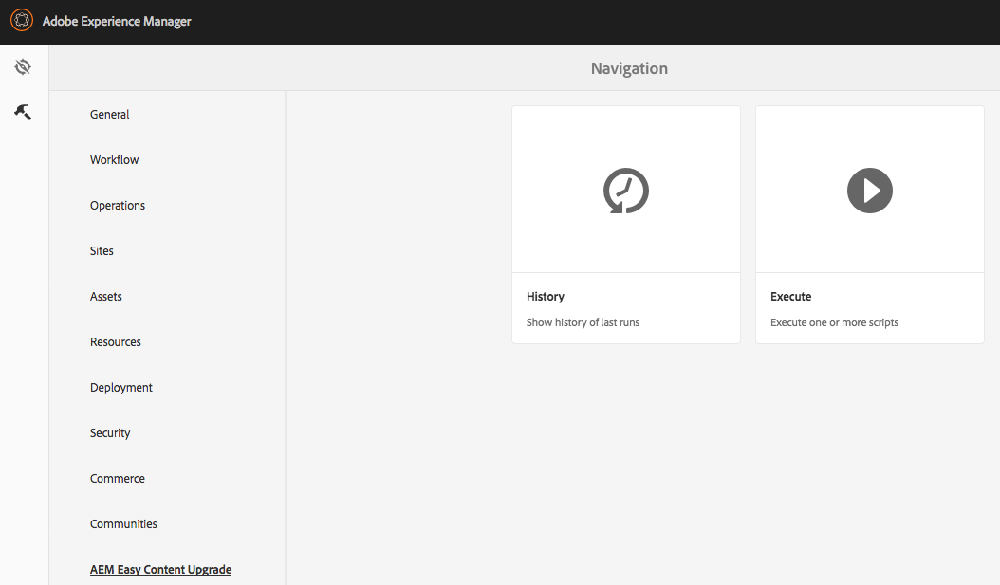
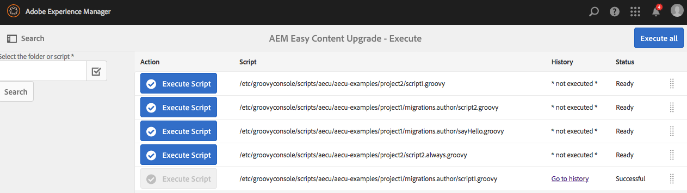
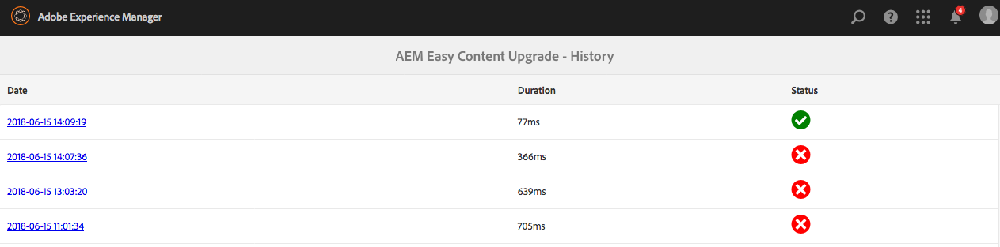
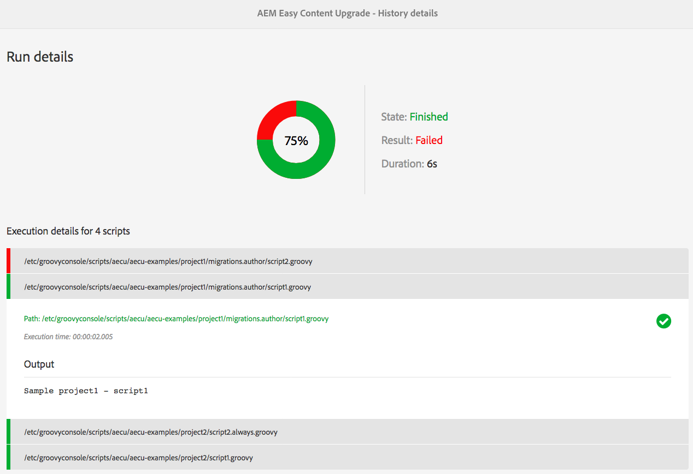
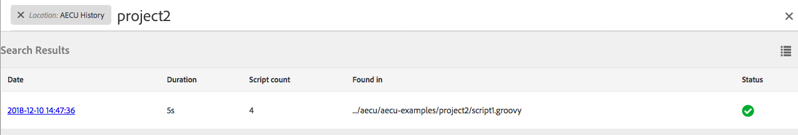
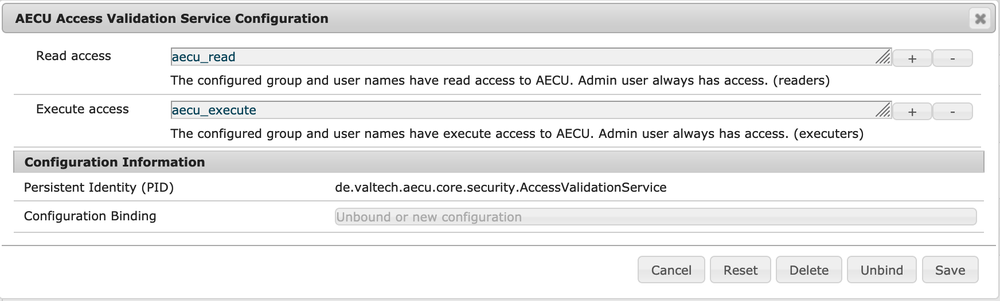
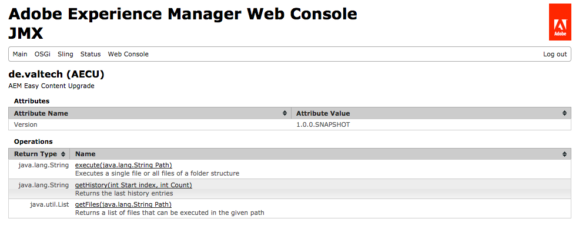
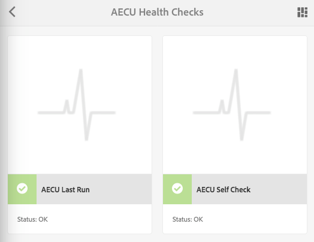

# AEM Easy Content Upgrade (AECU)

AECU simplifies content migrations by executing migration scripts during package installation. It is built on top of [Groovy Console](https://github.com/CID15/aem-groovy-console).


Features:

* GUI to run scripts and see history of runs
* Run mode support
* Fallback scripts in case of errors
* Extension of Groovy Console bindings
* Service API
* Health Checks

The tool was presented at [adaptTo() conference in Berlin](https://adapt.to/2018/en/schedule/aem-easy-content-upgrade.html). You can get the slides there and also see the video here:

[](https://www.youtube.com/watch?v=ZPEJ_cbzBoE "AECU @ adaptTo() 2018")

Table of contents
1. [Requirements](#requirements)
2. [Installation](#installation)
3. [File and Folder Structure](#structure)
4. [Execution of Migration Scripts](#execution)
    1. [Install Hook](#installHook)
    2. [Manual Execution](#manualExecution)
5. [History of Past Runs](#history)
6. [Extension to Groovy Console](#groovy)
    1. [Content Upgrades](#content_upgrades)
        1. [Collect Options](#binding_collect)
        2. [Filter Options](#binding_filter)
        3. [Execute Options](#binding_execute)
        4. [Run Options](#binding_run)
    2. [Rights and Roles Testing](#rights_and_roles_testing)
        1. [Defining Tests](#defining_tests)
        2. [Path Specification](#test_path_spec)
        3. [Group Specification](#test_group_spec)
        4. [Tests](#test_list)
        5. [Execute Tests](#test_execution)
7. [Security](#security)
    1. [Limit Access to AECU](#limitAccess)
    2. [Service Users](#serviceUsers)
8. [JMX Interface](#jmx)
9. [Health Checks](#healthchecks)
10. [API Documentation](#api)
11. [License](#license)
12. [Changelog](#changelog)
13. [Developers](#developers)


<a name="requirements"></a>

# Requirements

AECU requires Java 8 and AEM 6.5 or AEM Cloud. For older AEM versions see below.

| AEM Version   | Groovy Console | AECU      |
| ------------- | -------------- | --------- |
| 6.5 (>=6.5.3)<br/>Cloud | included     | 6.x, 5.x |

## Older AEM versions
For AEM 6.3/6.4 please see here what versions are compatible. Groovy Console can be installed manually if [bundle install](#bundleInstall) is not used.

| AEM Version   | Groovy Console | AECU      |
| ------------- | -------------- | --------- |
| 6.5 (>=6.5.3) | 16.x <br/>14.x, 13.x     | 4.x<br/> 3.x, 2.x |
| 6.4           | 14.x, 13.x               | 3.x, 2.x          |
| 6.3           | 12.x                     | 1.x               |

<a name="installation"></a>

# Installation

## AEM 6.5 and AEM Cloud

AECU includes the [Groovy Console](https://github.com/OlsonDigital/aem-groovy-console) package. Please do not install
Groovy Console manually. The API is not stable and using the included version makes sure AECU and Groovy Console
are compatible.

### AEM 6.5

You can download the package from [Maven Central](https://repo1.maven.org/maven2/de/valtech/aecu/aecu.complete/) or our [releases section](https://github.com/valtech/aem-easy-content-upgrade/releases). The aecu.complete package will install the AECU software and [Groovy Console](https://github.com/OlsonDigital/aem-groovy-console).

```xml
        <dependency>
            <groupId>de.valtech.aecu</groupId>
            <artifactId>aecu.complete</artifactId>
            <version>LATEST</version>
            <type>zip</type>
        </dependency>
```

### AEM Cloud

You can download the package from [Maven Central](https://repo1.maven.org/maven2/de/valtech/aecu/aecu.complete.cloud/) or our [releases section](https://github.com/valtech/aem-easy-content-upgrade/releases). The aecu.complete package will install the AECU software and [Groovy Console](https://github.com/OlsonDigital/aem-groovy-console).

```xml
        <dependency>
            <groupId>de.valtech.aecu</groupId>
            <artifactId>aecu.complete.cloud</artifactId>
            <version>LATEST</version>
            <type>zip</type>
        </dependency>
```

## Older AEM Versions (<6.5/Cloud)

You can download the package from [Maven Central](https://repo1.maven.org/maven2/de/valtech/aecu/aecu.ui.apps/) or our [releases section](https://github.com/valtech/aem-easy-content-upgrade/releases). The aecu.ui.apps package will install the AECU software. It requires that you installed [Groovy Console](https://github.com/OlsonDigital/aem-groovy-console) before.

```xml
        <dependency>
            <groupId>de.valtech.aecu</groupId>
            <artifactId>aecu.ui.apps</artifactId>
            <version>LATEST</version>
            <type>zip</type>
        </dependency>
```


<a name="bundleInstall"></a>

### Bundle Installation

To simplify installation we provide a bundle package that already includes the Groovy Console. This makes sure there are no compatibility issues.
The package is also available on [Maven Central](https://repo1.maven.org/maven2/de/valtech/aecu/aecu.bundle/) or our [releases section](https://github.com/valtech/aem-easy-content-upgrade/releases).

```xml
        <dependency>
            <groupId>de.valtech.aecu</groupId>
            <artifactId>aecu.bundle</artifactId>
            <version>LATEST</version>
            <type>zip</type>
        </dependency>
```


## Uninstallation

The application can be removed by deleting the following paths:
* `/apps/valtech/aecu`
* `/var/groovyconsole/scripts/aecu`
* `/conf/groovyconsole/scripts/aecu`
* `/var/aecu`
* `/var/aecu-installhook`

Afterwards, you can delete the "aecu.*" packages in package manager.

For Groovy Console delete:

* `/apps/groovyconsole`
* `/etc/clientlibs/groovyconsole`
* `/var/groovyconsole`

Then delete "aem-groovy-console" packages in package manager.


<a name="structure"></a>

# File and Folder Structure

All migration scripts need to be located in:

* `/apps/aecu-scripts` (AEM Cloud automatic execution with startup hook, since 6.0.0)
* `/conf/groovyconsole/scripts/aecu` (AEM onprem manual and install hook execution, AEM Cloud manual execution)
* `/var/groovyconsole/scripts/aecu` (deprecated)

AEM as a Cloud Service requires the scripts to be executed automatically in /apps to avoid issues with the startup hook. Manual scripts can still be located in /conf.

In this folder you can create an unlimited number of folders and files. E.g. organize your files by project or deployment.
The content of the scripts is plain Groovy code that can be run via [Groovy Console](https://github.com/OlsonDigital/aem-groovy-console).

If your package containing the scripts is bundled in another package please make sure that this is done using "subPackages" in pom.xml.


There are just a few naming conventions:

* Run modes: folders can contain run modes to limit the execution to a specific target environment. E.g. some scripts are for author only or for your local dev environment. Multiple 
run mode combinations can be separated with ";" (e.g. "folder.author.test;author.stage" will be executed on test+stage author but not on prod author).
* Always selector: if a script name ends with ".always.groovy" then it will be executed by
[install hook](#installHook) on each package installation. There will be no more check if this script
was already executed before.
* Fallback selector: if a script name ends with ".fallback.groovy" then it will be executed only if
the corresponding script failed with an exception. E.g. if there is "script.groovy" and "script.fallback.groovy" then the fallback script only gets executed if "script.groovy" fails.
* Prechecks selector: if a script name ends with ".prechecks.groovy" then it will be executed before
the corresponding script. If it fails with an exception then the corresponding script will be skipped. E.g. if there is "script.groovy" and "script.prechecks.groovy" then the "script.groovy" only gets executed if "script.prechecks.groovy" runs without exception.
* Reserved file names
    * fallback.groovy: optional directory level fallback script. This will be executed if a script fails and no script specific fallback script is provided.
    * prechecks.groovy: optional directory level prechecks script. This will be executed before a script runs and no script specific prechecks script is provided.
    
<a name="execution"></a>

# Execution of Migration Scripts

<a name="installHook"></a>

## Install Hook

This is the preferred method to execute your scripts. It allows to run them without any user interaction. Just package them with a content package and do a regular deployment.

You can add the install hook by adding de.valtech.aecu.core.installhook.AecuInstallHook as a hook to your package properties. The AECU package and Groovy Console need to be installed beforehand.

```xml
<plugin>
    <groupId>com.day.jcr.vault</groupId>
    <artifactId>content-package-maven-plugin</artifactId>
    <extensions>true</extensions>
    <configuration>
        <filterSource>src/main/content/META-INF/vault/filter.xml</filterSource>
        <verbose>true</verbose>
        <failOnError>true</failOnError>
        <group>Valtech</group>
        <properties>
            <installhook.aecu.class>de.valtech.aecu.core.installhook.AecuInstallHook</installhook.aecu.class>
        </properties>
    </configuration>
</plugin>
```

<a name="manualExecution"></a>

## Manual Execution

Manual script execution is useful in case you want to manually rerun a script (e.g. because it failed before). You can find the execute feature in AECU's tools menu.



Execution is done in two simple steps:

1. Select the base path and run the search. This will show a list of runnable scripts.
2. Run all scripts in batch or just single ones. If you run all you can change the order before (drag and drop with marker at the right).

Once execution is done you will see if the script(s) succeeded. Click on the history link to see the details.



<a name="history"></a>

# History of Past Runs

You can find the history in AECU's tools menu.


The history shows all runs that were executed via package install hook, manual run and JMX. It will not display scripts that were executed directly via Groovy Console.



You can click on any run to see the full details. This will show the status for each script. You can also see the output of all scripts.



## Search History (not on AEM Cloud)

AECU maintains a full-text search index for the history entries. You can search for script names and their output.

Simply click on the magnifying glass in header to open the search bar:


Now you can enter a search term and will see the runs that contain this text. Click on the link to see the full history entry.



<a name="groovy"></a>

# Extension to Groovy Console

AECU adds its own binding to Groovy Console. You can reach it using "aecu" in your script.

<a name="content_upgrades"></a>

## Content Upgrades

This part provides methods to perform common tasks like property modification or node deletion.

It follows a collect, filter, execute process.

<a name="binding_collect"></a>

### Collect Options
In the collect phase you define which nodes should be checked for a migration.

* forResources(String[] paths): use the given paths without any subnodes
* forChildResourcesOf(String path): use all direct childs of the given path (but no grandchilds)
* forDescendantResourcesOf(String path): use the whole subtree under this path excluding the parent root node
* forResourcesInSubtree(String path): use the whole subtree under this path including the parent root node
* forResourcesBySql2Query(String query): executes the query and applies actions on found resources
* forResourcesByPropertyQuery(String path, Map<String, String> conditionProperties): search in given path for the given list of property values (node type nt:base)
* forResourcesByPropertyQuery(String path, Map<String, String> conditionProperties, String nodeType): search in given path for the given list of property values using a specific node type (e.g. "nt:base")

You can call these methods multiple times and combine them. They will be merged together.

Example:

```java
aecu.contentUpgradeBuilder()
        .forResources((String[])["/content/we-retail/ca/en"])
        .forChildResourcesOf("/content/we-retail/us/en")
        .forDescendantResourcesOf("/content/we-retail/us/en/experience")
        .forResourcesInSubtree("/content/we-retail/us/en/experience")
        .forResourcesBySql2Query("SELECT * FROM [cq:Page] AS s WHERE ISDESCENDANTNODE(s,'/content/we-retail/us/en/experience')")
        .forResourcesByPropertyQuery("/content/we-retail/us", Collections.singletonMap("sling:resourceType", "weretail/components/content/heroimage"))
        .forResourcesByPropertyQuery("/content/we-retail/us", Collections.singletonMap("sling:resourceType", "%/heroimage"), "nt:base")
        .doSetProperty("name", "value")
        .run()
```

<a name="binding_filter"></a>

### Filter Options
These methods can be used to filter the nodes that were collected above. Multiple filters can be applied for one run.

#### Filter by Properties

Filters the resources by property values.

* filterByHasProperty: matches all nodes that have the given property. The value of the property is not relevant.
* filterByNotHasProperty: matches all nodes that do not have the given property. The value of the property is not relevant.
* filterByProperty: matches all nodes that have the given attribute value. Filter does not match if attribute is not present. By using a value of "null" you can search if an attribute is not present.
* filterByNotProperty: matches all nodes that do not have the given attribute value. Filter matches if attribute is not present.
* filterByProperties: use this to filter by a list of property values (e.g. sling:resourceType). All properties in the map are required to to match. Filter does not match if attribute does not exist.
* filterByNotProperties: use this to filter by a list of property values (e.g. sling:resourceType) is not matching. If any property in the map does not match the filter matches. Filter matches if attribute does not exist.
* filterByMultiValuePropContains: checks if all condition values are contained in the defined attribute. Filter does not match if attribute does not exist.
* filterByNotMultiValuePropContains: checks if not all condition values are contained in the defined attribute. Filter matches if attribute does not exist.
* filterByPropertyRegex: filters by a single property matching a regular expression for the value. This is intended for single value properties. Hint: use "(?s)" at the beginning of the regex to search multiline content.
* filterByNotPropertyRegex: filters by a single property not matching a regular expression for the value. This is intended for single value properties. Hint: use "(?s)" at the beginning of the regex to search multiline content.
* filterByAnyPropertyRegex: filters by any property that matches a given regular expression for the value. This reads all properties as single-valued String properties. Hint: use "(?s)" at the beginning of the regex to search multiline content.
* filterByNoPropertyRegex: filters by no property matching a given regular expression for the value. This reads all properties as single-valued String properties. Hint: use "(?s)" at the beginning of the regex to search multiline content.

```java
filterByHasProperty(String name)
filterByNotHasProperty(String name)
filterByProperty(String name, Object value)
filterByNotProperty(String name, Object value)
filterByProperties(Map<String, String> properties)
filterByNotProperties(Map<String, Object> conditionProperties)
filterByMultiValuePropContains(String name,  Object[] conditionValues)
filterByNotMultiValuePropContains(String name, Object[] conditionValues)
filterByPropertyRegex(String name, String regex)
filterByNotPropertyRegex(String name, String regex)
filterByAnyPropertyRegex(String regex)
filterByNoPropertyRegex(String regex)
```

Example:

```java
def conditionMap = [:]
conditionMap["sling:resourceType"] = "weretail/components/structure/page"

aecu.contentUpgradeBuilder()
        .forChildResourcesOf("/content/we-retail/ca/en")
        .filterByHasProperty("myProperty")
        .filterByProperty("sling:resourceType", "wcm/foundation/components/responsivegrid")
        .filterByProperties(conditionMap)
        .filterByMultiValuePropContains("myAttribute", ["value"] as String[])
        .filterByPropertyRegex("myproperty", ".*test.*")
        .filterByPropertyRegex("my_multiline_property", "(?s).*test.*")
        .filterByAnyPropertyRegex(".*test.*")
        .doSetProperty("name", "value")
        .run()
```

#### Filter by Node Name

You can also filter nodes by their name.

* filterByNodeName(String name): process only nodes which have this exact name
* filterByNotNodeName(String name): process only nodes which do not have this exact name
* filterByNodeNameRegex(String regex): process nodes that have a name that matches the given regular expression
* filterByNotNodeNameRegex(String regex): process nodes that have a name that does not match the given regular expression

```java
aecu.contentUpgradeBuilder()
        .forChildResourcesOf("/content/we-retail/ca/en")
        .filterByNodeName("jcr:content")
        .filterByNotNodeName("jcr:content")
        .filterByNodeNameRegex("jcr.*")
        .filterByNotNodeNameRegex("jcr.*")
        .doSetProperty("name", "value")
        .run()
```

#### Filter by Node Path

Nodes can also be filtered by their path using a regular expression.

* filterByPathRegex(String regex): process nodes whose path matches the given regular expression
* filterByNotPathRegex(String regex): process nodes whose path does not match the given regular expression

```java
aecu.contentUpgradeBuilder()
        .forChildResourcesOf("/content/we-retail/ca/en")
        .filterByPathRegex(".*/jcr:content/.*")
        .filterByNotPathRegex(".*/jcr:content/.*")
        .doSetProperty("name", "value")
        .run()
```

#### Filter by Node Existence

Filters resources by the (non-)existence of relative or absolute node path.

* filterByNodeExists(String path): process if the given subnode or absolute node exists
* filterByNodeNotExists(String path): process if the given subnode or absolute node does not exist

```java
aecu.contentUpgradeBuilder()
        .forChildResourcesOf("/content/we-retail/ca/en")
        .filterByNodeExists("jcr:content/meta")
        .filterByNodeExists("/content")
        .filterByNodeNotExists("jcr:content/meta")
        .filterByNodeNotExists("/content")
        .doSetProperty("name", "value")
        .run()
```

#### Combine Multiple Filters
You can combine filters with AND and OR to build more complex filters.

```java
def conditionMap_type = [:]
conditionMap_type['sling:resourceType'] = "weretail/components/content/heroimage"
def conditionMap_file = [:]
conditionMap_file['fileReference'] = "/content/dam/we-retail/en/activities/running/fitness-woman.jpg"
def conditionMap_page = [:]
conditionMap_page['jcr:primaryType'] = "cq:PageContent"

def complexFilter =  new ORFilter(
        [ new FilterByProperties(conditionMap_page),
          new ANDFilter( [
                  new FilterByProperties(conditionMap_type),
                  new FilterByProperties(conditionMap_file)
          ] )
        ])

aecu.contentUpgradeBuilder()
        .forDescendantResourcesOf("/content/we-retail/ca/en", false)
        .filterWith(complexFilter)
        .filterNotWith(complexFilter)
        .filterWith(new NOTFilter(new FilterByPathRegex(".*jcr:content.*")))
        .doSetProperty("name", "value")
        .run()        
```

<a name="binding_execute"></a>

### Execute Options

#### Update Single-value Properties

* doSetProperty(String name, Object value): sets the given property to the value. Any existing value is overwritten.
* doSetProperty(String name, Object value, String pathToSubnode): sets the given property in the subnode to the value. If subnode does not exist it will be created as nt:unstructured (incl. missing intermediate nodes). Any existing value is overwritten.
* doSetProperty(String name, Object value, String pathToSubnode, String primaryType): sets the given property in the subnode to the value. If subnode does not exist it will be created as given in primaryType (incl. missing intermediate nodes). Any existing value is overwritten.
* doDeleteProperty(String name): removes the property with the given name if existing.
* doDeleteProperty(String name, String pathToSubnode): removes the property on subnode pathToSubnode with the given name if existing.
* doRenameProperty(String oldName, String newName): renames the given property if existing. If the new property name already exists it will be overwritten.
* doRenameProperty(String oldName, String newName, String pathToSubnode): renames the given property on subnode pathToSubnode if existing. If the new property name already exists it will be overwritten.

```java
aecu.contentUpgradeBuilder()
        .forChildResourcesOf("/content/we-retail/ca/en")
        .filterByNodeName("jcr:content")
        .doSetProperty("name", "value")
        .doSetProperty("name", "value", "root/breadCrumb")
        .doDeleteProperty("nameToDelete")
        .doDeleteProperty("nameToDelete", "root/breadCrumb")
        .doRenameProperty("oldName", "newName")
        .doRenameProperty("oldName", "newName", "root/breadCrumb")
        .run()
```

#### Update Multi-value Properties

* doAddValuesToMultiValueProperty(String name, String[] values): adds the list of values to a property. The property is created if it does not yet exist.
* doRemoveValuesOfMultiValueProperty(String name, String[] values): removes the list of values from a given property. 
* doReplaceValuesOfMultiValueProperty(String name, String[] oldValues, String[] newValues): removes the old values and adds the new values in a given property. 
* doJoinProperty(String name): joins values of a property into a single value. Uses "," to join multiple values. Deletes properties with empty array values.
* doJoinProperty(String name, Object fallback): joins values of a property into a single value. Uses "," to join multiple values. Sets the fallback for properties having an empty array as a value.
* doJoinProperty(String name, Object fallback, String separator): joins values of a property into a single value. Uses the given separator to join multiple values. Sets the fallback for properties having an empty array as a value.

```java
aecu.contentUpgradeBuilder()
        .forChildResourcesOf("/content/we-retail/ca/en")
        .filterByNodeName("jcr:content")
        .doAddValuesToMultiValueProperty("name", (String[])["value1", "value2"])
        .doRemoveValuesOfMultiValueProperty("name", (String[])["value1", "value2"])
        .doReplaceValuesOfMultiValueProperty("name", (String[])["old1", "old2"], (String[])["new1", "new2"])
        .doJoinProperty("name")
        .doJoinProperty("name", "fallbackValue")
        .doJoinProperty("name", "fallbackValue", ",")
        .run()
```

#### Copy and Move Properties

This will copy or move a property to a subnode. You can also change the property name.

* doCopyPropertyToRelativePath(String name, String newName, String relativeResourcePath): copy the property to the given path under the new name.
* doMovePropertyToRelativePath(String name, String newName, String relativeResourcePath): move the property to the given path under the new name.

```java
aecu.contentUpgradeBuilder()
        .forChildResourcesOf("/content/we-retail/ca/en")
        .filterByNodeName("jcr:content")
        .doCopyPropertyToRelativePath("name", "newName", "subnode")
        .doMovePropertyToRelativePath("name", "newName", "subnode")
        .run()
```

#### Replace Property Content
You can replace the content of String properties. This also supports multi-value properties.

* doReplaceValueInAllProperties(String oldValue, String newValue): replaces the substring "oldValue" with "newValue". Applies to all String properties
* doReplaceValueInProperties(String oldValue, String newValue, String[] propertyNames): replaces the substring "oldValue" with "newValue". Applies to all specified String properties
* doReplaceValueInAllPropertiesRegex(String searchRegex, String replacement): checks if the property value(s) match the search pattern and replaces it with "replacement". Applies to all String properties. You can use group references such as $1 (hint: "$" needs to be escaped with "\" in Groovy).
* doReplaceValueInPropertiesRegex(String searchRegex, String replacement, String[] propertyNames): checks if the property value(s) match the search pattern and replaces it with "replacement".  Applies to specified String properties. You can use group references such as $1 (hint: "$" needs to be escaped with "\" in Groovy).
* doChangePrimaryType(String newPrimaryType) (since 3.3.0): changes primary type of the resource to the given primary type

```java
aecu.contentUpgradeBuilder()
        .forChildResourcesOf("/content/we-retail/ca/en")
        .filterByNodeName("jcr:content")
        .doReplaceValueInAllProperties("old", "new")
        .doReplaceValueInProperties("old", "new", (String[]) ["propertyName1", "propertyName2"])
        .doReplaceValueInAllPropertiesRegex("/content/([^/]+)/(.*)", "/content/newSub/\$2")
        .doReplaceValueInPropertiesRegex("/content/([^/]+)/(.*)", "/content/newSub/\$2", (String[]) ["propertyName1", "propertyName2"])
        .doChangePrimaryType("nt:unstructured")
        .run()
```

#### Copy and Move Nodes

The matching nodes can be copied/moved to a new location. You can use ".." if you want to step back in path.

* doRename(String newName): renames the resource to the given name
* doCopyResourceToRelativePath(String relativePath): copies the node to the given target path
* doCopyResourceToRelativePath(String relativePath, String newName): copies the node to the given target path under the new name
* doMoveResourceToRelativePath(String relativePath): moves the node to the given target path
* doMoveResourceToPathRegex(String matchPattern, String replacementExpr): moves a resource if its path matches the pattern to the target path obtained by applying the replacement expression. You can use group references such as $1 (hint: "$" needs to be escaped with "\" in Groovy).
* doReorderNode(String nameOfNodeToMove, String newSuccessor) (since AECU 5.1.0): reorders subnode "nameOfNodeToMove" before subnode "newSuccessor". Set "newSuccessor" to null to order at the end.

```java
aecu.contentUpgradeBuilder()
        .forChildResourcesOf("/content/we-retail/ca/en")
        .filterByNodeName("jcr:content")
        .doRename("newNodeName")
        .doCopyResourceToRelativePath("subNode")
        .doCopyResourceToRelativePath("../subNode", "newName")
        .doMoveResourceToRelativePath("../subNode")
        .doMoveResourceToPathRegex("/content/we-retail/(\\w+)/(\\w+)/(\\w+)", "/content/somewhere/\$1/and/\$2")
        .doReorderNode("toMove", "successor")
        .run()
```

#### Create Nodes

Sometimes a new node needs to be created e.g. to add or configure a component.

* doCreateResource(String name, String primaryType): creates a new node using the name and primary type
* doCreateResource(String name, String primaryType, Map<String, Object> properties): creates a new node using additional properties
* doCreateResource(String name, String primaryType, String relativePath): same as above but creates the node under the relative path
* doCreateResource(String name, String primaryType, Map<String, Object> properties, String relativePath): same as above but creates the node under the relative path

```java
def map = [
  "testval": "test"
]

aecu.contentUpgradeBuilder()
        .forResources((String[]) ["/content/we-retail/jcr:content"])
        .doCreateResource("mynode1", "nt:unstructured")
        .doCreateResource("mynode2", "nt:unstructured", map)
        .doCreateResource("mysubnode1", "nt:unstructured", "mynode1")
        .doCreateResource("mysubnode2", "nt:unstructured", map, "mynode2")
        .run()
```

#### Delete Nodes

You can delete nodes that match your collection and filter.

* doDeleteResource(): deletes the resource that matched the collection and filter 
* doDeleteResource(String... children): deletes the specified child nodes of the matching resource

```java
aecu.contentUpgradeBuilder()
        .forChildResourcesOf("/content/we-retail/ca/en")
        .filterByNodeName("jcr:content")
        .doDeleteResource()
        .doDeleteResource("child1", "child2", "child3")
        .run()
```

##### Node (De)activation

Please note that this is for non-page resources such as commerce products. For page level (de)activation there are [separate methods](#binding_page_replication).

* doActivateResource(): activates the current resource
* doDeactivateResource(): deactivates the current resource

```java
aecu.contentUpgradeBuilder()
        .forChildResourcesOf("/content/we-retail/ca/en")
        .doDeactivateResource()
        .doActivateResource()
        .run()
```

#### Page Actions

AECU can run actions on the page that contains a filtered resource. This is e.g. helpful if you filter by page resource type.

Please note that there is no check for duplicate actions. If you run a page action for two resources in the same page then the action will be executed twice.

<a name="binding_page_replication"></a>

##### Page (De)activation

* doActivateContainingPage(): activates the page that contains the current resource
* doDeactivateContainingPage(): deactivates the page that contains the current resource
* doTreeActivateContainingPage(): activates the page that contains the current resource AND all subpages
* doTreeActivateContainingPage(boolean skipDeactivated): activates the page that contains the current resource AND all subpages. If "skipDeactivated" is set to true then deactivated pages will be ignored and not activated.

```java
aecu.contentUpgradeBuilder()
        .forChildResourcesOf("/content/we-retail/ca/en")
        .filterByProperty("sling:resourceType", "weretail/components/structure/page")
        .doActivateContainingPage()
        .doDeactivateContainingPage()
        .doTreeActivateContainingPage()
        .doTreeActivateContainingPage(true)
        .run()
```

##### Page Deletion

* doDeleteContainingPage(): deletes the page (incl. subpages) that contains the current resource

```java
aecu.contentUpgradeBuilder()
        .forChildResourcesOf("/content/we-retail/ca/en")
        .filterByProperty("sling:resourceType", "weretail/components/structure/page")
        .doDeleteContainingPage()
        .run()
```

##### Page Tagging

Tags can be specified by Id (e.g. "properties:style/color") or path (e.g. "/etc/tags/properties/orientation/landscape").

* doAddTagsToContainingPage(): adds the given tags to the page
* doSetTagsForContainingPage(): sets the page's tags. This will delete any tags that were assigned but are not part of the new tag list. An empty list of tags will delete all tags.
* doRemoveTagsFromContainingPage(): removes the given tags from the page

```java
aecu.contentUpgradeBuilder()
        .forChildResourcesOf("/content/we-retail/ca/en")
        .filterByProperty("sling:resourceType", "weretail/components/structure/page")
        .doAddTagsToContainingPage("properties:style/color", "/etc/tags/properties/orientation/landscape")
        .doSetTagsForContainingPage("properties:style/color", "/etc/tags/properties/orientation/landscape")
        .doRemoveTagsFromContainingPage("properties:style/color", "/etc/tags/properties/orientation/landscape")
        .run()
```

##### Validate Page Rendering

AECU can do some basic tests if pages render correctly. You can use this to verify a migration run.

* doCheckPageRendering(): checks if page renders with status code 200
* doCheckPageRendering(int code): checks if page renders with given status code 
* doCheckPageRendering(String textPresent): verifies that the given text is included in page output + page renders with code 200
* doCheckPageRendering(String textPresent, String textNotPresent): verifies that the given text is (not) included in page output + page renders with code 200. The parameters textPresent/textNotPresent can be set to null if you do not need the check.

```java
aecu.contentUpgradeBuilder()
        .forChildResourcesOf("/content/we-retail/ca/en")
        .filterByProperty("sling:resourceType", "weretail/components/structure/page")
        .doCheckPageRendering()
        .doCheckPageRendering(200)
        .doCheckPageRendering("some test string")
        .doCheckPageRendering("some test string", "exception")
        .run()
```

#### Print Nodes and Properties

Sometimes, you only want to print some information about the matched nodes.

* printPath(): prints the path of the matched node
* printProperty(String property): prints the value of the specified property of the matched node
* printJson(): prints a json representation of all the matched node's properties

```java
aecu.contentUpgradeBuilder()
        .forChildResourcesOf("/content/we-retail/ca/en")
        .filterByNodeName("jcr:content")
        .printPath()
        .printProperty("sling:resourceType")
        .printJson()
        .run()
```

#### Custom Actions

You can also hook in custom code to perform actions on resources. For this "doCustomResourceBasedAction()" can take a Lambda expression.

* doCustomResourceBasedAction(): run your custom code

```java
def myAction = {
    resource -> 
    hasChildren = resource.hasChildren()
    String output = resource.path + " has children: "
    output += hasChildren ? "yes" : "no"
    return output
}

aecu.contentUpgradeBuilder()
        .forChildResourcesOf("/content/we-retail/ca/en")
        .doCustomResourceBasedAction(myAction)
        .run()
```


<a name="binding_run"></a>

### Run Options

At the end you can run all actions or perform a dry-run first. The dry-run will just provide output about modifications but not save any changes. The normal run saves the session, no additional "session.save()" is required.

* run(): performs all actions and saves the session
* dryRun(): only prints actions but does not perform repository changes
* run(boolean dryRun): the "dryRun" parameter defines if it should be a run or dry-run

<a name="rights_and_roles_testing"></a>

## Rights and Roles Testing

AECU allows you to automate permission tests. This greatly speeds up your testing in this area since

* test can be run by developers and testers
* test scripts can be written by developers and testers
* easy to read test summaries make it easy to identify open topics
* test scripts can be executed during package install and fail the installation if needed

Note: Testing is only be supported on group level. User level permissions are not supported as it is bad practice to assign permissions directly to users.

<a name="defining_tests"></a>

### Defining Tests

Each test block starts with "aecu.validateAccessRights()". Then you define the paths and groups to check with "forPaths/forGroups".
Next, the actions to check are listed (e.g. "canRead()"). For each action there is also a "cannot" test.
Finally, you start the test with "validate/simulate".

```
aecu
    .validateAccessRights()
    .forPaths("/content/we-retail/us/en/men", "/content/we-retail/de", "/content/we-retail/fr")
    .forGroups("content-authors")
    .canRead()
    .canModify()
    .canDeletePage()
    .validate()
```

You can call forPaths()/forGroups() multiple times. The can(not)* tests will always use the last one.
E.g. this will test
 * content-authors: read, modify, delete page
 * content-readers: read, no-modify, no-delete page
The paths are the same for both groups.

```
aecu
    .validateAccessRights()
    .forPaths("/content/we-retail/us/en/men", "/content/we-retail/de", "/content/we-retail/fr")
    .forGroups("content-authors")
    .canRead()
    .canModify()
    .canDeletePage()
    .forGroups("content-readers")
    .canRead()
    .cannotModify()
    .cannotDeletePage()
    .validate()
```

<a name="test_path_spec"></a>

#### Path Specification

The list of paths to check is set via "forPaths()". Here you can simply set all paths needed.
Please note that the tests take some time. Therefore, take some example paths but not each and every page.

```
aecu
    .validateAccessRights()
    .forPaths("/content/we-retail/us/en/men", "/content/we-retail/de", "/content/we-retail/fr")
    .forGroups("content-authors")
    .canRead()
    .validate()
```

<a name="test_group_spec"></a>

#### Group Specification

The list of groups to check is set via "forGroups()". Here you can simply set all groups needed.
If groups need different checks then use multiple "forGroups()" or multiple calls of "aecu.validateAccessRights()".

```
aecu
    .validateAccessRights()
    .forPaths("/content/we-retail/us/en/men")
    .forGroups("content-authors", "content-readers")
    .canRead()
    .validate()
```

<a name="test_list"></a>

#### Tests

##### Simple ACL Tests
These are the basic tests to check e.g. for read/write access to a page/resource.

 * canRead(): has read access to specified path
 * cannotRead(): does not have read access to specified path
 * canModify(): has write access to specified path
 * cannotModify(): does not have write access to specified path
 * canCreate(): can create new nodes (e.g. pages) in specified path
 * cannotCreate(): cannot create new nodes (e.g. pages) in specified path
 * canDelete(): has delete permission to specified path
 * cannotDelete(): does not have delete permission to specified path
 * canReplicate(): can (de)activate the specified path
 * cannotReplicate(): cannot (de)activate the specified path
 * canReadAcl(): can read the ACLs of the specified path
 * cannotReadAcl(): cannot read the ACLs of the specified path
 * canWriteAcl(): can change the ACLs of the specified path
 * cannotWriteAcl(): cannot change the ACLs of the specified path
 
 Example:

```
aecu
    .validateAccessRights()
    .forPaths("/content/we-retail/us/en/men", "/content/we-retail/de", "/content/we-retail/fr")
    .forGroups("content-readers")
    .canRead()
    .cannotModify()
    .cannotReplicate()
    .validate()
```

##### Page Tests
The following tests include additional checks for page nodes. Use them if you know the tested path is a page.
As they inherit from the simple ACL tests (e.g. "canReadPage()" includes "canRead()") there is no need to call both.

 * canReadPage(): page exists and is readable
 * cannotReadPage(): page exists and is not readable
 * canCreatePage(String templatePath): subpage with given template path can be created. The test fails if the template is not allowed at this position.
 * cannotCreatePage(String templatePath): subpage with given template path cannot be created or template not allowed at this position.
 * canModifyPage(): a test property can be set on the page content resource
 * cannotModifyPage(): the test property cannot be set on the page content resource
 * canDeletePage(): page can be removed (please note that this can take a lot of time if the page has lots of subpages, use canDelete() if you have issues)
 * cannotDeletePage(): page cannot be removed
 
 Example:

```
aecu
    .validateAccessRights()
    .forPaths("/content/we-retail/us/en/men", "/content/we-retail/de", "/content/we-retail/fr")
    .forGroups("content-authors")
    .canReadPage()
    .canModifyPage()
    .canCreatePage("/conf/we-retail/settings/wcm/templates/content-page")
    .validate()
```

The following replication tests require "simulate()":
 
 * canReplicatePage(ReplicationActionType type): page can be replicated with given action (e.g. activate)
 * canReplicatePage(): page can be activated
 * cannotReplicatePage(): page cannot be activated
 * cannotReplicatePage(ReplicationActionType type): page cannot be replicated with given action (e.g. activate)
 
 Example:

```
aecu
    .validateAccessRights()
    .forPaths("/content/we-retail/us/en/men", "/content/we-retail/de", "/content/we-retail/fr")
    .forGroups("content-authors")
    .canReadPage()
    .canModifyPage()
    .canCreatePage("/conf/we-retail/settings/wcm/templates/content-page")
    .canReplicatePage()
    .canReplicatePage(ReplicationActionType.ACTIVATE)
    .simulate()
```


<a name="test_execution"></a>

#### Execute Tests

The tests are executed with "validate()" or "simulate()". The call of "validate()" does not persist any changes.
In contrast, "simulate()" will also perform actions that cannot be rolled-back. E.g. "simulate()" will do
an actual page activation for "canReplicatePage()".

If any test requires "simulate()" then it will be noted in its description.

```
aecu
    .validateAccessRights()
    .forPaths("/content/we-retail/us/en/men", "/content/we-retail/de", "/content/we-retail/fr")
    .forGroups("content-authors")
    .canRead()
    .validate()

aecu
    .validateAccessRights()
    .forPaths("/content/we-retail/us/en/men", "/content/we-retail/de", "/content/we-retail/fr")
    .forGroups("content-authors")
    .canReplicatePage()
    .simulate()

```

Sample output:

```
┌───────────────┬────────────────────────────┬────────┐
│Group          │Path                        │Rights  │
├───────────────┼────────────────────────────┼────────┤
│content-authors│/content/we-retail/de       │OK: Read│
│               │/content/we-retail/fr       │OK: Read│
│               │/content/we-retail/us/en/men│OK: Read│
└───────────────┴────────────────────────────┴────────┘
```

##### Fail Script Execution
You can stop the whole script execution when a test fails. This will mark the script run as failed.

By default, script execution will not stop on test failures.

 * failOnError(): stop execution on failed test
 * failOnError(boolean fail): stop execution on failed test if "fail" is true
 

```
aecu
    .validateAccessRights()
    .forPaths("/content/we-retail/us/en/men", "/content/we-retail/de", "/content/we-retail/fr")
    .forGroups("content-authors")
    .cannotReadPage()
    .failOnError()
    .validate()
```


<a name="security"></a>

# Security

<a name="limitAccess"></a>

## Limit Access to AECU (since 3.2)
For production systems it is recommended to limit the access to specific user groups.
This can be done via OSGI configuration. Here you can specify groups for read and execute access.

Please not that user "admin" and group "administrators" always has full access. If no groups are specified then nobody except admin/administrators has access.

PID for OSGI config: de.valtech.aecu.core.security.AccessValidationService



<a name="serviceUsers"></a>

## Service Users
The following service users are installed by AECU:

| User          | Rights | Description |
| ------------- | -------------- | --------- |
| aecu-admin | /: jcr:all | Validation of access rights, JMX executeWithHistory() to store script history |
| aecu-content-migrator | /: jcr:read <br /> /apps: jcr:all <br /> /conf: jcr:all <br /> /content: jcr:all <br /> /etc: jcr:all <br /> /home: jcr:all <br /> /var: jcr:all | Content changes using aecu binding  |
| aecu-service | /: jcr:read <br /> /var/aecu: jcr:all | AECU execution history |


<a name="jmx"></a>

# JMX Interface



AECU provides JMX methods for executing scripts and reading the history. You can also check the version here.

## Execute

This will execute the given script or folder. If a folder is specified then all files (incl. any subfolders) are executed. AECU will respect run modes during execution.

Parameters:
 * Path: file or folder to execute

## ExecuteWithHistory

Use this e.g. when you copied over content from production to development and need to rerun install hook scripts.

This will execute the given script or folder. If a folder is specified then all files (incl. any subfolders) are executed. AECU will respect run modes and install hook history during execution. This means that scripts that were already executed by install hook are ignored. After execution the install hook history will be updated.

Parameters:
 * Path: file or folder to execute
 
Sample curl call:

```
curl -u admin:admin 'http://localhost:5902/system/console/jmx/de.valtech%3Atype%3DAECU/op/executeWithHistory/java.lang.String' --data-raw 'Path=/conf/groovyconsole/scripts/aecu'
```

## GetHistory

Prints the history of the specified last runs. The entries are sorted by date and start with the last run.

Parameters:
 * Start index: starts with 0 (= latest history entry)
 * Count: number of entries to print

## GetFiles

This will print all files that are executable for a given path. You can use this to check which scripts of a given folder would be executed.

Parameters:
* Path: file or folder to check


<a name="healthchecks"></a>

# Health Checks

Health checks show you the status of AECU itself and the last migration run.
You can access them on the [status page](http://localhost:4502/libs/granite/operations/content/healthreports/healthreportlist.html/system/sling/monitoring/mbeans/org/apache/sling/healthcheck/HealthCheck/aecuHealthCheckmBean).
For the status of older runs use AECU's history page.



<a name="api"></a>

# API Documentation

You can access our AECU service (AecuService class) in case you have special requirements. See the [API documentation](https://valtech.github.io/aem-easy-content-upgrade/).

<a name="license"></a>

# License

The AECU tool is licensed under the [MIT LICENSE](LICENSE).

<a name="changelog"></a>

# Changelog

Please see our [history file](HISTORY).

<a name="developers"></a>

# Developers

See our [developer zone](docs/developers.md).
